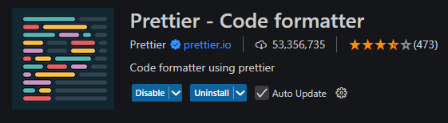
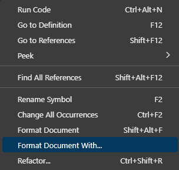
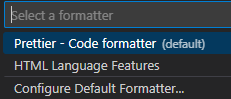
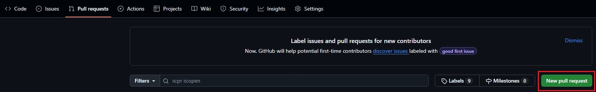
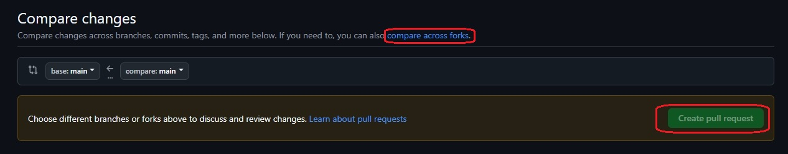

# Правила проекта

1. Каждый раздел верстки делается в отдельной ветки, которая сливается с основной только после PullRequest.
   Ответвления делаем от ветки Develop, ветка main существует для релизных версий приложения.
2. Чужой код (и файлы) трогаем только на CodeRewiew, в присутствии автора.
3. Стараемся писать независимые разделы кода, чтобы не создавать конфликтов с другими участниками.
4. По распределению/отслеживанию задач и общению: предлагаю телеграмм, ибо канбан доски сильно муторно.
5. Дедлайн ставим себе сами, типо: сделаю header через 3 месяца. (а мы пишем приложение дальше, просто без шапки).
6. Используем БЭМ методологию.
7. По возможности документируем компоненты, миксины, функции и другие переиспользуемые элементы.
8. Не забываем время от времени подтягивать изменения друг друга в свои.

# Технологический стек

- HTML
- Препроцессор стилей Sass (scss)
- JavaScript
- Библиотека для создания анимаций Anime.js (для Ивана)
- Git, GitHub

# Структура проекта

- _/assets_ - статические файлы (шрифты, медиафайлы)
  - _/assets/docs_ - статические файлы необходимые для документации
  - _/assets/svg_ - файлы формата svg
  - _/assets/img_ - файлы формата png, jpg, webp
- _/lib_ - код сторонних библиотек
- _/pages_ - html разметка страниц
- _/scripts_ - все, что относиться к миру javascript
- _/styles_ - все, что относиться к стилизации
  - _/styles/css_ - автоматически созданная папка при компиляции sass файлов (если правильно выполнили настройку расширения Live Sass Compiller)
  - _/styles/sass_ - человеко-писанные таблицы стилей
  - _/styles/sass/components_ - стили БЭМ блоков приложения
  - _/styles/sass/globals_:
    - _base_ - базовые стили для html, body и селекторов по тегу (использовать с осторожностью, чтобы избежать конфликтов из-за специфичности)
    - _fonts_ - подключение/настройка шрифтов
    - _normalize_ - нормализация стилей (у разных браузеров разные настройки по умолчанию, мы приводим их к единому знаменателю)
    - _utils_ - универсальные/утилитарные классы, настройки
  - _/styles/sass/helpers_:
    - _functions_ - функции sass
    - _mixins_ - миксины sass
    - _variables_ - переменные sass и css

**Файлы index.scss нужны для "пробрасывания" файлов вверх по иерархии (реэкспорт), это называется Public API (если ничего не путаю)**

# Стиль проекта

- Именование файлов - с маленькой буквы, кебаб нотация (исключения: js классы)
- БЭМ блок = отдельному файлу стилей
- Делить большие файлы на модули - это хорошо

# Указываем тип коммита

- feature — используется при добавлении новой функциональности уровня приложения
- fix — если исправили какую-то серьезную багу
- docs — всё, что касается документации
- style — исправляем опечатки, исправляем форматирование
- refactor — рефакторинг кода приложения

**Лучше написать: _добавил футер_, чем просто: _футер_. Что ты с этим футером сделал? Удалил, добавил, изменил, проклял?**

# Как заставить sass компилироваться в папку styles/css ?

1. Устанавливаем в VS Code расширение Live Sass Compiller
2. Открываем параметры в VS Code по умолчанию - это сочетание клавиш: ctrl+,
3. Вводим в строку параметры поиска текст: liveSassCompile.settings.formats.
4. Находим ниже ссылку: Изменить в settings.json и нажимаем на неё.
5. В открывшемся окне видим слева интересуемый нас параметр и его настройки по умолчанию, ставим следующие:

```json
"liveSassCompile.settings.formats": [
    {
      "format": "expanded",
      "extensionName": ".css",
      "savePath": "/styles/css"
    }
  ],
```

# Настройка Prettier

- Установить расширение Prettier - Code formatter



- Добавить в корень проекта файл .prettierrc.json, если его нет
- Отформатировать файл с помощью Prettier:

  
  

- Или установить Prettier форматтером по умолчанию: configute default formatter (на прошлом скриншоте)

### Как начать внести вклад в проект если ты не коллаборатор?

1. Делаем форк данного репозитория


2. Клонируем репозиторий себе на локальную машину (из своего форка)

```bash
git clone https://github.com/IvanBadProger/VRNas.git
```

3. Вносим изменения в репозиторий (обязательно в отдельной ветке)
4. Пушим изменения в форк

```bash
git push
```

5. Создаем PullRequest своего форка в основной репозиторий:

- Переходим на вкладку Pull Requests
  

- Создаем новый Pull Request

  
