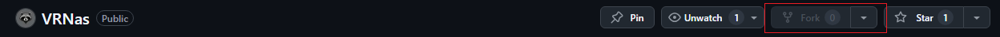

# Правила проекта
1. Каждый раздел верстки делается в отдельной ветки, которая сливается с основной только после PullRequest.
2. Чужой код (и файлы) трогаем только на CodeRewiew, в присутствии автора.
3. Стараемся писать независимые разделы кода, чтобы не создавать конфликтов с другими участниками.
4. По распределению/отслеживанию задач и общению: предлагаю телеграмм, ибо канбан доски сильно муторно.
5. Дедлайн ставим себе сами, типо: сделаю header через 3 месяца. (а мы пишем приложение дальше, просто без шапки).
6. Используем БЭМ методологию.
7. По возможности документируем компоненты, миксины, функции и другие переиспользуемые элементы.

# Технологический стек
- HTML
- Препроцессор стилей Sass (scss)
- JavaScript
- Библиотека для создания анимаций Anime.js (для Ивана)
- Git, GitHub

# Структура проекта 
- */assets* - статические файлы (шрифты, медиафайлы)
  * */assets/docs* - статические файлы необходимые для документации
  * */assets/svg* - файлы формата svg
  * */assets/img* - файлы формата png, jpg, webp
- */lib* - код сторонних библиотек
- */pages* - html разметка страниц
- */scripts* - все, что относиться к миру javascript
- */styles* - все, что относиться к стилизации
  * */styles/css* - автоматически созданная папка при компиляции sass файлов (если правильно выполнили настройку расширения Live Sass Compiller)
  * */styles/sass* - человеко-писанные таблицы стилей
  * */styles/sass/components* - стили БЭМ блоков приложения
  * */styles/sass/globals*:
    - *base* - базовые стили для html, body и селекторов по тегу (использовать с осторожностью, чтобы избежать конфликтов из-за специфичности)
    - *fonts* - подключение/настройка шрифтов 
    - *normalize* - нормализация стилей (у разных браузеров разные настройки по умолчанию, мы приводим их к единому знаменателю)
    - *utils* - универсальные/утилитарные классы, настройки
  * */styles/sass/helpers*: 
    - *functions* - функции sass
    - *mixins* - миксины sass
    - *variables* - переменные sass и css

**Файлы index.scss нужны для "пробрасывания" файлов вверх по иерархии (реэкспорт), это называется Public API (если ничего не путаю)**

# Указываем тип коммита 
- feature — используется при добавлении новой функциональности уровня приложения
- fix — если исправили какую-то серьезную багу
- docs — всё, что касается документации
- style — исправляем опечатки, исправляем форматирование
- refactor — рефакторинг кода приложения

**Лучше написать: *добавил футер*, чем просто: *футер*. Что ты с этим футером сделал? Удалил, добавил, изменил, проклял? **

# Как заставить sass компилироваться в папку styles/css ?
1. Устанавливаем в VS Code расширение Live Sass Compiller
2. Открываем параметры в VS Code по умолчанию - это сочетание клавиш: ctrl+,
3. Вводим в строку параметры поиска текст: liveSassCompile.settings.formats.
4. Находим ниже ссылку: Изменить в settings.json и нажимаем на неё.
5. В открывшемся окне видим слева интересуемый нас параметр и его настройки по умолчанию, ставим следующие: 
```json
"liveSassCompile.settings.formats": [
    {
      "format": "expanded",
      "extensionName": ".css",
      "savePath": "/styles/css"
    }
  ],
```

# Как начать внести вклад в проект если ты не коллаборатор?
1. Делаем форк данного репозитория



2. Клонируем репозиторий себе на локальную машину (из своего форка)
```bash
git clone https://github.com/IvanBadProger/VRNas.git
```
3. Вносим изменения в репозиторий (обязательно в отдельной ветке)
4. Пушим изменения в форк
```bash
git push
```
5. Создаем PullRequest своего форка в основной репозиторий:
- Переходим на вкладку Pull Requests

- Создаем новый Pull Request
